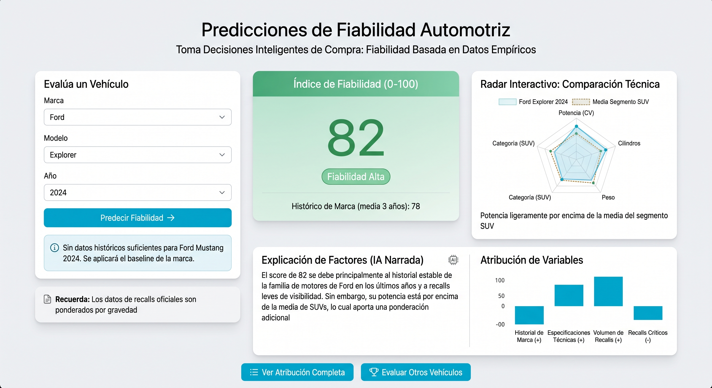

# AutoReliability — Predicción y análisis de recalls de seguridad

AutoReliability es un proyecto de Data Science desarrollado como Trabajo de Fin de Máster. Su objetivo es reducir la asimetría de información en la compra de vehículos mediante el análisis de registros históricos de campañas de retirada por defectos de seguridad (*recalls*).

El proyecto combina datos técnicos de vehículos con registros oficiales de la **National Highway Traffic Safety Administration (NHTSA)** para generar un índice estadístico y facilitar la consulta y comparación de vehículos mediante una aplicación web interactiva.

> **Importante:** El índice es un indicador indirecto basado en recalls de seguridad. No representa la fiabilidad mecánica general ni la probabilidad individual de sufrir una avería.

## 1. Funcionalidades

La aplicación, desarrollada con Streamlit, permite:

- Consultar vehículos por marca, modelo y año.
- Obtener un índice histórico de propensión a recalls.
- Consultar la referencia de grupo que produce la estimación. El perfil técnico y el historial se muestran como contexto separado, no como factores del baseline.
- Comparar los resultados de dos vehículos.
- Consultar campañas oficiales de recalls de la NHTSA.
- Exportar los resultados en CSV y PDF.



## 2. Fuentes y procesamiento de datos

El proyecto utiliza las siguientes fuentes:

- **NHTSA:** registros oficiales de campañas de retirada por defectos de seguridad.
- **CooperUnion — Car Features and MSRP:** especificaciones técnicas de vehículos del mercado estadounidense.
- **EPA/DOE:** fuentes complementarias utilizadas para investigar la ampliación de la cobertura temporal.

Los datos se procesan mediante una arquitectura **Raw → Processed → Gold**, que incluye limpieza, normalización, cruce de identidades y construcción del conjunto de datos utilizado para entrenar los modelos.

El predictor publicado utiliza datos técnicos de vehículos comprendidos entre 1995 y 2017. La consulta independiente de recalls oficiales permite acceder a registros de vehículos más recientes.

## 3. Modelo predictivo

### Construcción del índice

La variable objetivo se construye a partir de las campañas de recalls registradas en el año-modelo y los dos años calendario siguientes. Es una ventana común de observación, no los primeros 36 meses de vida de cada unidad.

Las campañas reciben una ponderación heurística según las palabras clave de sus descripciones:

| Categoría | Peso |
|---|---:|
| Crítica | 3,0 |
| Moderada | 1,5 |
| Baja o no clasificada | 1,0 |

La suma ponderada se normaliza respecto a las estadísticas del segmento, calculadas sobre los datos de entrenamiento, para obtener un índice de 0 a 100.

**Una puntuación mayor representa una referencia de grupo más favorable en el indicador de recalls construido.** La normalización por categoría impide interpretar cualquier diferencia entre categorías como una diferencia directa en número de campañas. No representa un porcentaje de fiabilidad, una probabilidad individual de avería ni demuestra que un coche sea una mejor compra.

### Entrenamiento y selección

Se han evaluado tres alternativas:

- Baseline histórico por marca y categoría.
- Ridge Regression.
- Random Forest.

El modelo seleccionado actualmente es el **baseline histórico**, que utiliza la media del índice del grupo marca/categoría aprendido durante el ajuste. Cuando no hay soporte para ese grupo, puede recurrir a la referencia de marca según la política del estimador. La ruta web rechaza marcas no representadas en el baseline entrenado, sin sustituirlas silenciosamente por la media global.

Por tanto, dos vehículos del mismo grupo pueden recibir la misma estimación aunque tengan diferentes características técnicas o años de fabricación.

### Resultados de evaluación

La fuente de las cifras es [artifacts/model_metrics.json](artifacts/model_metrics.json), cuya copia debe coincidir con la [publicación activa](releases/active.json). La tabla siguiente y la de la Entrega 5 se verifican automáticamente contra ese JSON; no son resultados de evaluaciones distintas.

<!-- AUTO_RELIABILITY_METRICS:START -->
| Métrica | Resultado |
|---|---:|
| Modelo seleccionado | Baseline de marca y categoría |
| Entrenamiento para selección | 287 casos; 1995–2005 |
| Validación | 90 casos; 2008–2009 |
| Ajuste final sin test | 377 casos |
| MAE de validación baseline | 10,5771 |
| RMSE de validación baseline | 13,7543 |
| MAE de validación Ridge | 10,9386 |
| RMSE de validación Ridge | 13,4978 |
| MAE de validación Random Forest | 10,8236 |
| RMSE de validación Random Forest | 13,5027 |
| Test | 819 casos; 2012–2017 |
| MAE de test | 12,1537 |
| RMSE de test | 16,9991 |
<!-- AUTO_RELIABILITY_METRICS:END -->

La evaluación utiliza separación temporal y embargo para la madurez de las etiquetas. El ajuste final combina entrenamiento y validación, sin incorporar el test. El MAE es el error absoluto medio de la población evaluada: **no es un intervalo individual ni un margen de ±MAE para cada coche**. Los errores varían entre grupos.

Ridge y Random Forest no superaron al baseline en el criterio principal, MAE de validación. Sí mejoraron ligeramente el RMSE de validación; el baseline no gana en todas las métricas. Random Forest tampoco satisfizo la mejora estrictamente superior al 10 % frente a Ridge exigida por el protocolo. No se alcanzó el objetivo original de una mejora predictiva adicional al baseline y no se presenta como alcanzado.

## 4. Tecnologías utilizadas

| Área | Tecnologías |
|---|---|
| Lenguaje | Python |
| Procesamiento de datos | Pandas, NumPy |
| Almacenamiento | SQLite, Parquet |
| Machine Learning | Scikit-learn |
| Visualización | Streamlit, Plotly, Matplotlib |
| Informes | ReportLab |
| Pruebas | Pytest, Ruff, GitHub Actions |

El código conserva atribuciones para Ridge y Random Forest y una integración local opcional con Ollama para otros candidatos. **No intervienen en la explicación del baseline publicado**: esta es determinista y describe la referencia de grupo frente a la media global de entrenamiento, no efectos de potencia, cilindros o historial reciente ni causas de averías.

## 5. Instalación y ejecución

### Requisitos

- Python 3.10 o superior.
- Git.
- Conexión a Internet para la instalación inicial y las consultas externas.

Clonar el repositorio:

```bash
git clone https://github.com/ros1ndoo/Trabajo-de-Fin-de-Master.git
cd Trabajo-de-Fin-de-Master
```

En Windows, preparar el entorno desde PowerShell:

```powershell
.\scripts\setup.ps1
```

Iniciar la aplicación:

```powershell
.\scripts\start.ps1
```

La aplicación estará disponible en:

http://127.0.0.1:8501

El repositorio incluye el modelo entrenado y los datasets Gold necesarios para cargar el predictor publicado. No es necesario volver a entrenarlo para utilizar la aplicación.

### Pruebas automatizadas

```bash
python -m pytest -q
python -m ruff check src tests app.py
python -m auto_reliability.documentation
```

GitHub Actions ejecuta estas comprobaciones utilizando Python 3.10 y 3.12.

Para consultar el bloque de métricas generado desde la publicación, sin modificar archivos: `python -m auto_reliability.documentation --show`. La comprobación falla si las tablas documentales o las métricas de trabajo se desvían de la publicación activa.

## 6. Limitaciones y trabajo futuro

AutoReliability es un prototipo académico funcional con las siguientes limitaciones:

- **Cobertura temporal:** el predictor publicado utiliza especificaciones técnicas hasta 2017 y no está validado para lanzamientos actuales.
- **Representatividad:** existen vehículos e identidades no resueltas que pueden introducir sesgos de selección.
- **Capacidad predictiva:** el baseline utiliza una referencia histórica por marca y categoría, sin distinguir necesariamente entre modelos concretos del mismo grupo.
- **Interpretación:** los recalls no permiten medir directamente la fiabilidad mecánica ni determinar el estado de una unidad individual.
- **Validación:** los errores varían entre grupos y no se ha demostrado una mejora predictiva homogénea respecto al baseline.

Las futuras líneas de desarrollo incluyen evaluar la utilidad y comprensión con usuarios reales, ampliar la cobertura técnica, resolver las identidades y consultas pendientes y evaluar nuevos modelos con datos adicionales no utilizados para orientar cambios. El test publicado ya se ha examinado; sus reanálisis no constituyen una nueva evaluación independiente. Un fallo de consulta nunca se convierte en cero recalls y un cero en la ventana observada no acredita ausencia de campañas durante toda la vida del vehículo.

## 7. Conclusión

AutoReliability integra adquisición y procesamiento de datos, ingeniería de características, entrenamiento de modelos y desarrollo de una aplicación interactiva.

El resultado es una herramienta que permite consultar y contextualizar información histórica sobre recalls de seguridad, proporcionando una referencia estadística complementaria para investigar vehículos antes de su compra.

El proyecto demuestra la aplicación práctica de técnicas de Data Science a un problema real, manteniendo explícitas las limitaciones de los datos y del modelo predictivo.

---

**AutoReliability — Trabajo de Fin de Máster en Data Science.**
