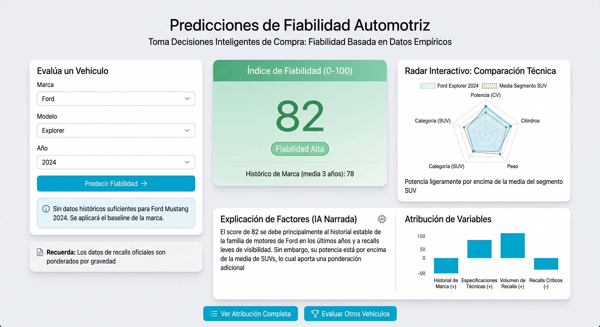

# 05_diseno_frontal.md

## 1. Resumen de la solución y del usuario
*   **Problema que resuelve:** El proyecto aborda la asimetría de información en el sector automotriz al adquirir vehículos de reciente lanzamiento, donde las decisiones de compra se basan en el marketing en lugar de en la fiabilidad empírica. Resolver esto aportaría impacto económico y protegería al consumidor evitando gastos imprevistos de mantenimiento y tiempos de inactividad.
*   **Usuario principal:** Consumidores particulares y gestores de flotas que necesiten una herramienta analítica de apoyo antes de realizar una inversión automotriz.
*   **Necesidad concreta:** El usuario necesita obtener una estimación anticipada de la propensión a fallos de los nuevos motores para basar su decisión en datos objetivos.
*   **Tipo de producto:** Se está diseñando un dashboard web interactivo y predictor.
*   **Resultado principal:** El usuario obtendrá una predicción continua (escala 0 a 100) sobre la fiabilidad del vehículo (`prediccion_indice_100`) y visualizaciones interactivas que comparen las características técnicas de dicho vehículo con la media histórica de su categoría.

## 2. Imagen mockup del frontal

La imagen principal ha sido conceptualizada utilizando el sistema de diseño de Bootstrap y permite identificar:
*   **La información que introduce el usuario:** Menús desplegables integrados en una tarjeta para seleccionar la `marca`, el `modelo` y el `año_fabricacion` (restringido desde 1995 a la actualidad).
*   **El resultado producido:** El KPI principal o variable objetivo (`indice_fiabilidad_100`), un score predictivo de fiabilidad que se calcula mediante un modelo de regresión.
*   **El contexto necesario:** Gráficos (como un radar interactivo) que cruzan especificaciones como la `mediana_cilindros` y la `mediana_cv` del vehículo contra la media de su `categoria_vehiculo` (ej. SUV, Sedán).
*   **La acción principal y navegación:** Botones estilizados (ej. `btn-primary` de Bootstrap) para evaluar otros vehículos o ver la atribución de las variables clave que impulsan el resultado predictivo.
*   **Los elementos de estado, alerta y error:** Se aprecian visualmente marcadores de estado, como un icono de carga (spinner) al ejecutar la consulta, y un espacio reservado para mensajes de alerta (banners de colores) en caso de introducir un coche sin datos históricos suficientes o si se produce un error en el cruce de datos.

## 3. Justificación del diseño

### 3.1. Utilidad y valor de la solución
*   **Qué problema resuelve el frontal:** Permite traducir un ecosistema de datos complejos, que cruza especificaciones técnicas con el historial gubernamental de *recalls* de la NHTSA, en una interfaz comprensible.
*   **Qué resultado facilita:** Ayuda a contextualizar el score predictivo para el usuario final, permitiendo comparar el vehículo con competidores directos para facilitar la decisión de compra.
*   **Información esencial y oculta:** Se ha decidido mostrar el KPI numérico final y las características técnicas relevantes, ocultando el complejo cálculo interno de la variable (como la ponderación de recalls por gravedad o la estandarización intra-segmento con Z-score) para evitar sobrecargar al usuario.
*   **Recomendación útil:** El uso de componentes visuales convierte la estimación de fiabilidad en una recomendación de inversión clara y accionable.

### 3.2. Flujo de usuario
1.  **Punto de entrada:** El usuario visualiza un panel inicial limpio (ej. Hero section) y un formulario que le pide seleccionar el coche que tiene en mente.
2.  **Entradas (Selección):** Filtra secuencialmente la `Marca`, el `Modelo` y el `Año` de lanzamiento de su interés.
3.  **Procesamiento:** El sistema consulta la tabla maestra analítica `gold_us_car_reliability.parquet` y ejecuta el modelo de regresión (Ridge o Ensamblado).
4.  **Resultado:** Se muestra el score `prediccion_indice_100` y gráficos que comparan si la carga técnica (potencia, cilindros) difiere significativamente de su segmento.
5.  **Acción:** El usuario puede interpretar los motivos del score, descargar el resumen o buscar un modelo distinto para comparar.
6.  **Excepciones:** Si los datos del coche no están disponibles debido a que el cruce por *Fuzzy Matching* falló y generó registros huérfanos, el frontal mostrará un mensaje de error comprensible y sugerirá la predicción *baseline*, basada en la media histórica de la marca en ese segmento.

### 3.3. Experiencia de usuario
*   **Jerarquía visual:** El número principal (score de fiabilidad 0-100) capta primero la atención con tipografía destacada, al ser la respuesta directa a la necesidad del usuario.
*   **Simplicidad:** Se opta por un indicador de 0 a 100 fácil de entender, omitiendo métricas de validación del modelo como el MAE o el RMSE en la pantalla principal.
*   **Legibilidad y consistencia:** Se aplicará una paleta de colores semántica (verde para alta fiabilidad, rojo para baja o para errores) y unidades de medida estandarizadas en los gráficos. Se mantendrá una consistencia visual en todas las pantallas (tipografías, espaciados y tamaños de botones).
*   **Contexto y confianza:** Se proporciona una métrica de contexto llamada `hist_fiabilidad_marca`, que muestra la media móvil de la fiabilidad del fabricante en los 3 años previos, generando confianza al enmarcar el resultado.
*   **Control del usuario:** El usuario tiene control total para reiniciar el formulario, modificar un único campo (como cambiar solo el año manteniendo el modelo para ver su evolución) o borrar los resultados actuales fácilmente.
*   **Feedback del sistema:** Se usarán indicadores de carga mientras se realiza la predicción y confirmaciones o mensajes de alerta visuales si las entradas del formulario están incompletas.
*   **Accesibilidad y adaptación:** El dashboard será responsivo mediante un sistema de rejilla (*grid*), asegurando una visualización correcta tanto en escritorio como en dispositivos móviles.

## 4. Presentación de resultados y explicabilidad
*   **Presentación del resultado analítico:** El resultado principal es la `prediccion_indice_100`, un índice numérico continuo estimado a través de una regresión, que se presentará acompañado del contexto técnico en forma de comparativa con su sector.
*   **Incertidumbre:** Se evitará presentar la estimación como certeza absoluta; la interfaz incluirá la variable `explicacion_factores` para detallar qué impulsó el resultado, basada en la interpretabilidad de la Regresión Lineal Ridge o en valores SHAP si se usa un modelo avanzado.
*   **IA Generativa como capa de explicación:** Se utilizará IA Generativa de forma estrictamente acotada. Su función será tomar los resultados de interpretabilidad técnica (los pesos y factores clave de la regresión) y resumirlos en un párrafo narrado en lenguaje natural para el consumidor final. Esta IA estará rígidamente fundamentada en los resultados controlados del modelo y en el dataset `gold_us_car_reliability` para mantener la trazabilidad y evitar cualquier tipo de alucinación o invención de causas.

## 5. Alcance del MVP
*   **Se implementará de forma funcional:** El predictor web interactivo, donde los desplegables consumirán los datos de la capa final (`gold_us_car_reliability.parquet`) y calcularán una estimación en tiempo real aplicando el modelo de Machine Learning. La comparativa visual con las medias del segmento también será interactiva. 
*   **Tecnología prevista:** Para la implementación tecnológica del MVP funcional se utilizará el framework **Streamlit** para Python (apoyado en Plotly para los gráficos interactivos tipo radar), aplicando estilos y componentes visuales que respeten el diseño propuesto en el mockup original.
*   **No se implementará (sólo conceptual):** El plan alternativo de contingencia descrito en el análisis, que proponía prescindir de la variable de averías de la API y desarrollar un *web scraper* de precios de segunda mano para calcular la depreciación económica, no formará parte de este desarrollo al superar el alcance realista del curso.
